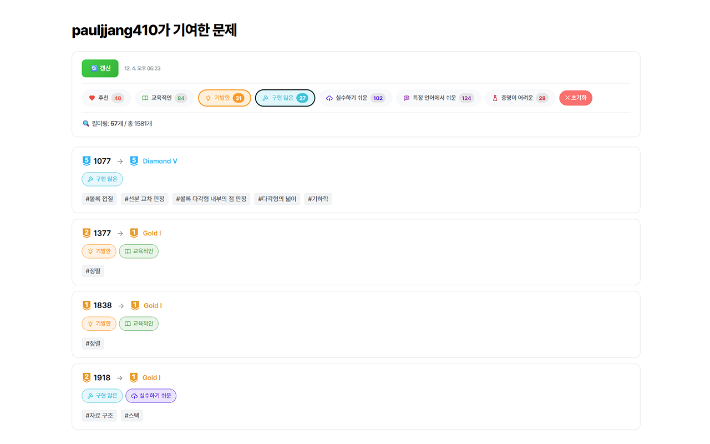

<p align="center">
  
</p>

<h1 align="center">solved.tags</h1>

<p align="center">
  <strong>solved.ac 기여 페이지에서 메타 태그 통계를 확인하세요</strong>
</p>

<p align="center">
  <a href="#features">Features</a> •
  <a href="#installation">Installation</a> •
  <a href="#usage">Usage</a> •
  <a href="#development">Development</a> •
  <a href="#license">License</a>
</p>

---

## ✨ Features

[solved.ac](https://solved.ac) 프로필의 **기여(votes)** 페이지에서 자신이 투표한 문제들의 메타 태그를 한눈에 확인할 수 있습니다.

- 📊 **메타 태그 통계** - 7가지 메타 태그별 기여 개수 확인
- 🔍 **필터링** - 특정 메타 태그가 포함된 문제만 필터링
- 💾 **캐싱** - 로컬 스토리지에 데이터 캐싱
- 🌙 **다크 모드** - 시스템 설정에 따른 자동 다크 모드 지원

### 지원하는 메타 태그

| 태그 | 설명 |
|------|------|
| ❤️ 추천 | 좋은 문제로 추천 |
| 📚 교육적인 | 학습에 도움이 되는 문제 |
| 💡 기발한 | 창의적인 아이디어가 필요한 문제 |
| 🔧 구현 많은 | 구현량이 많은 문제 |
| ⚡ 실수하기 쉬운 | 실수하기 쉬운 함정이 있는 문제 |
| 💬 특정 언어에서 쉬운 | 특정 프로그래밍 언어에서 유리한 문제 |
| 🧪 증명이 어려운 | 풀이의 정당성 증명이 어려운 문제 |

---

## 📦 Installation

### Chrome

1. [Chrome Web Store](#)에서 설치 (심사 후 게시 예정)

**또는 수동 설치:**

1. [Releases](../../releases)에서 `solved-tags-chrome.zip` 다운로드
2. 압축 해제
3. Chrome에서 `chrome://extensions` 접속
4. 우측 상단 **개발자 모드** 활성화
5. **압축해제된 확장 프로그램을 로드합니다** 클릭
6. 압축 해제한 폴더 선택

### Firefox

1. [Firefox Add-ons](#)에서 설치 (심사 후 게시 예정)

**또는 수동 설치:**

1. [Releases](../../releases)에서 `solved-tags-firefox.zip` 다운로드
2. Firefox에서 `about:debugging#/runtime/this-firefox` 접속
3. **임시 부가 기능 로드** 클릭
4. zip 파일 또는 `manifest.json` 선택

---

## 🚀 Usage

1. 확장 프로그램 아이콘 클릭
2. **내 핸들** 입력 (solved.ac 핸들)
3. 자신의 프로필 기여 페이지 방문: `https://solved.ac/profile/{핸들}/votes`
4. **메타 태그 불러오기** 버튼 클릭
5. 태그별 통계 확인 및 필터링!

<p align="center">
  
</p>

---

## 🛠 Development

### 요구 사항

- Node.js 18+
- npm 또는 yarn

### 설치

```bash
git clone https://github.com/your-username/solved.tags.git
cd solved.tags
npm install
```

### 빌드

```bash
# Chrome용 빌드
npm run build

# Firefox용 빌드
npm run build:firefox

# 둘 다 빌드
npm run build:all
```

### 개발 모드

```bash
# 파일 변경 감지 및 자동 빌드
npm run dev
```

### 프로젝트 구조

```
solved.tags/
├── src/
│   ├── assets/
│   │   └── icons/          # 확장 프로그램 아이콘
│   ├── background/
│   │   └── background.js   # 백그라운드 서비스 워커
│   ├── content/
│   │   ├── ui/
│   │   │   ├── filterBar.js    # 필터 바 UI
│   │   │   ├── filter.js       # 필터 로직
│   │   │   └── problemList.js  # 문제 목록 렌더링
│   │   ├── api.js          # solved.ac API 통신
│   │   ├── cache.js        # 로컬 스토리지 캐싱
│   │   ├── content.css     # 컨텐츠 스타일
│   │   └── index.js        # 컨텐츠 스크립트 진입점
│   ├── popup/
│   │   ├── popup.html      # 팝업 UI
│   │   ├── popup.css       # 팝업 스타일
│   │   └── popup.js        # 팝업 로직
│   ├── shared/
│   │   └── constants.js    # 공유 상수 (메타 태그 등)
│   ├── manifest.json       # Chrome 매니페스트 (MV3)
│   └── manifest.firefox.json # Firefox 매니페스트 (MV2)
├── dist/                   # Chrome 빌드 출력
├── dist-firefox/           # Firefox 빌드 출력
├── vite.config.js          # Vite 빌드 설정
└── package.json
```

---

## 📄 License

MIT License

---

## 🙏 Credits

- [solved.ac](https://solved.ac) - 백준 난이도 및 태그 서비스
- [Tabler Icons](https://tabler-icons.io) - SVG 아이콘
- [Pretendard](https://github.com/orioncactus/pretendard) - 폰트

### Contributors

- [@oh040411](https://www.acmicpc.net/user/oh040411) - 다크모드 버그 제보
- [@hibye1217](https://www.acmicpc.net/user/hibye1217) - 난이도 미제공 티어 버그 제보, 메타 태그 배치 아이디어 제공

---

<p align="center">
  Made with ❤️ for the competitive programming community
</p>
