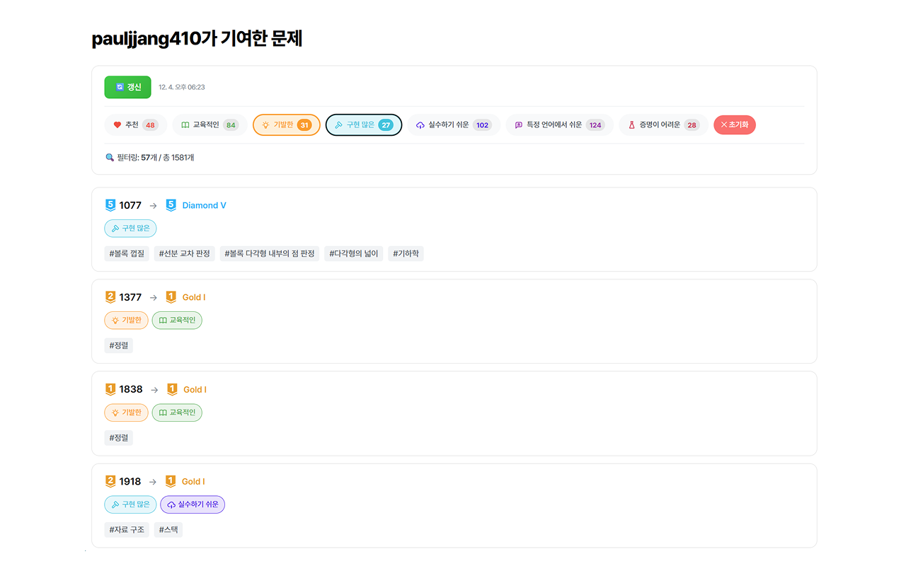

<p align="center">
  
</p>

<h1 align="center">solved.tags</h1>

<p align="center">
  <strong>solved.ac 기여 페이지에서 메타 태그 통계를 확인하세요</strong>
</p>

<p align="center">
  <a href="#-features">Features</a> •
  <a href="#-installation">Installation</a> •
  <a href="#-usage">Usage</a> •
  <a href="#-development">Development</a> •
  <a href="#-license">License</a>
  <a href="#-Credits">Credits</a>
</p>

---

## ✨ Features

[solved.ac](https://solved.ac) 프로필의 **기여(votes)** 페이지에서 자신이 투표한 문제들의 메타 태그를 한눈에 확인할 수 있습니다.

- **메타 태그 통계** - 7가지 메타 태그별 기여 개수 확인
- **필터링** - 특정 메타 태그가 포함된 문제만 필터링
- **정렬** - 기여 순서, 문제 번호, 난이도 순으로 정렬
- **코멘트 표시** - 기여 시 작성한 코멘트 확인
- **캐싱** - 로컬 스토리지에 데이터 캐싱 (수동 갱신 전까지 유지)
- **다크 모드** - 시스템 설정에 따른 자동 다크 모드 지원
- **CSV/JSON 내보내기** - 기여 데이터를 CSV 또는 JSON 형식으로 내보내기

### 지원하는 메타 태그

| 태그 | 설명 |
|------|------|
| 추천 | 좋은 문제로 추천 |
| 기발한 | 창의적인 아이디어가 필요한 문제 |
| 교육적인 | 학습에 도움이 되는 문제 |
| 구현 많은 | 구현량이 많은 문제 |
| 실수하기 쉬운 | 실수하기 쉬운 함정이 있는 문제 |
| 특정 언어에서 쉬운 | 특정 프로그래밍 언어에서 유리한 문제 |
| 증명이 어려운 | 풀이의 정당성 증명이 어려운 문제 |

## 📦 Installation

### Chrome

1. [Chrome Web Store](https://chromewebstore.google.com/detail/solvedtags/ofcomeknbplijbojjmhcpanandbpckek)에서 설치

**또는 수동 설치:**

1. [Releases](../../releases)에서 `solved-tags-chrome.zip` 다운로드
2. 압축 해제
3. Chrome에서 `chrome://extensions` 접속
4. 우측 상단 **개발자 모드** 활성화
5. **압축해제된 확장 프로그램을 로드합니다** 클릭
6. 압축 해제한 폴더 선택

### Firefox

1. [Firefox Add-ons](https://addons.mozilla.org/ko/firefox/addon/solved-tags/)에서 설치

**또는 수동 설치:**

1. [Releases](../../releases)에서 `solved-tags-firefox.zip` 다운로드
2. Firefox에서 `about:debugging#/runtime/this-firefox` 접속
3. **임시 부가 기능 로드** 클릭
4. zip 파일 또는 `manifest.json` 선택

---

## 🚀 Usage

1. 확장 프로그램 아이콘 클릭
2. **내 핸들** 입력 (solved.ac 핸들)
3. 자신의 프로필 기여 페이지 방문: `https://solved.ac/profile/{핸들}/votes`
4. **메타 태그 불러오기** 버튼 클릭
5. 태그별 통계 확인 및 필터링!

<p align="center">
  
</p>

---

## 🛠 Development

> 이 프로젝트는 [WXT](https://wxt.dev/) 프레임워크를 사용합니다.

### 요구 사항

- Node.js 18+
- npm

### 설치

```bash
git clone https://github.com/GreenScreen410/solved-tags.git
cd solved-tags
npm install
```

### 빌드

```bash
# Chrome용 빌드
npm run build

# Firefox용 빌드
npm run build:firefox

# 둘 다 빌드
npm run build:all

# Zip 패키징
npm run zip
npm run zip:firefox
```

### 개발 모드

```bash
# Chrome 개발 서버 (HMR 지원)
npm run dev

# Firefox 개발 서버
npm run dev:firefox
```

### 프로젝트 구조

```
solved-tags/
├── src/
│   ├── entrypoints/
│   │   ├── background.js      # 백그라운드 서비스 워커
│   │   ├── content.js         # 컨텐츠 스크립트 진입점
│   │   ├── content/
│   │   │   ├── ui/
│   │   │   │   ├── filterBar.js    # 필터 바 UI
│   │   │   │   ├── filter.js       # 필터 로직
│   │   │   │   ├── panel.js        # 플로팅 패널 UI
│   │   │   │   └── problemList.js  # 문제 목록 렌더링
│   │   │   ├── api.js         # solved.ac API 통신
│   │   │   ├── cache.js       # 로컬 스토리지 캐싱
│   │   │   ├── content.css    # 컨텐츠 스타일
│   │   │   └── theme.js       # 테마 감지
│   │   └── popup/
│   │       ├── index.html     # 팝업 UI
│   │       ├── style.css      # 팝업 스타일
│   │       └── main.js        # 팝업 로직
│   └── utils/
│       └── constants.js       # 공유 상수 (메타 태그 등)
├── public/                    # 정적 에셋 (아이콘 등)
├── .output/                   # 빌드 출력 (WXT)
├── wxt.config.ts              # WXT 설정 (매니페스트 포함)
└── package.json
```

---

## 📄 License

MIT License

---

## 🙏 Credits

- [solved.ac](https://solved.ac) - 백준 난이도 및 태그 서비스
- [WXT](https://wxt.dev/) - 브라우저 확장 프로그램 프레임워크
- [Tabler Icons](https://tabler-icons.io) - SVG 아이콘
- [Pretendard](https://github.com/orioncactus/pretendard) - 폰트

### Contributors

- [@oh040411](https://www.acmicpc.net/user/oh040411) - 다크모드 버그 제보
- [@hibye1217](https://www.acmicpc.net/user/hibye1217) - 난이도 미제공 티어 버그 제보, 메타 태그 배치 아이디어 제공
- [@js7777](https://www.acmicpc.net/user/js7777) - 난이도 미제공 티어 버그 제보, 페이지 이동 관련 버그 제보

---

<p align="center">
  Made with ❤️ for the competitive programming community
</p>
